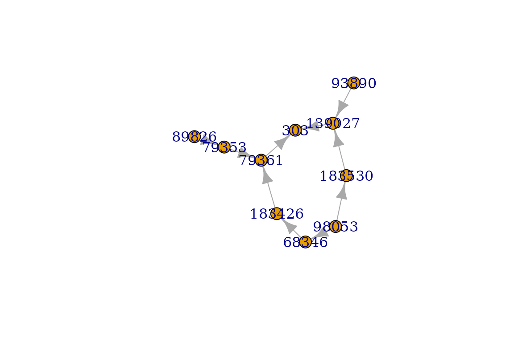
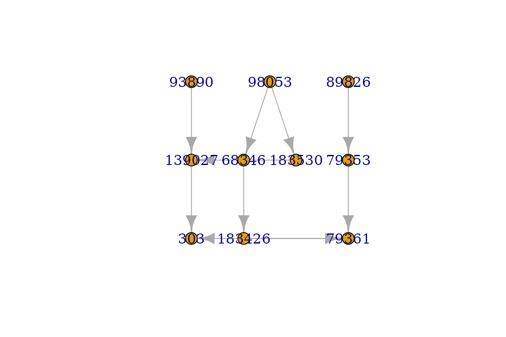
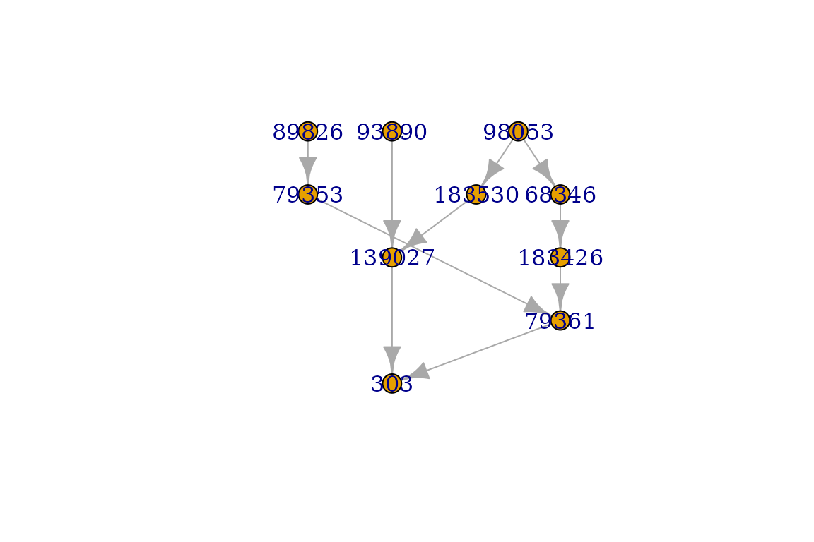
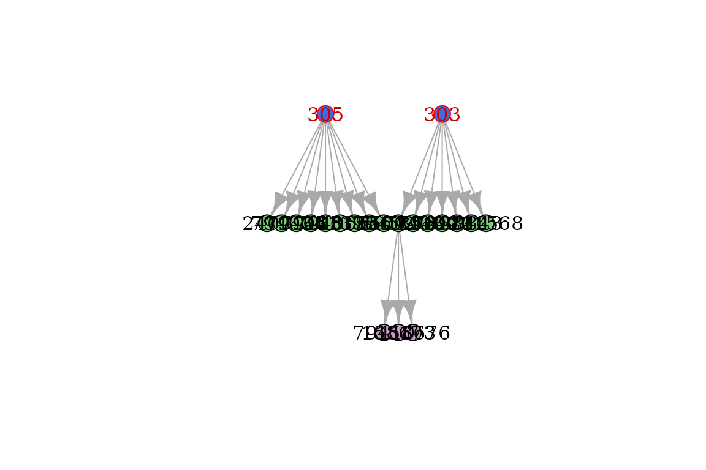
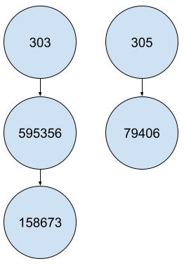
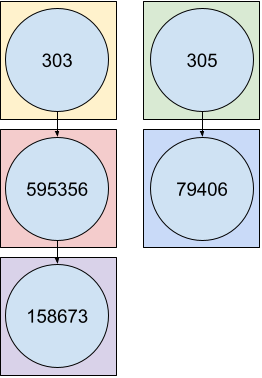
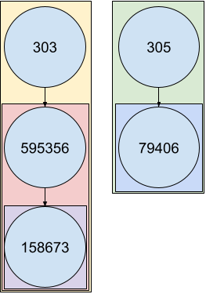

# RDaggregator (R interface)

`RDaggregator` is an open-source library consisting in using
[Orphanet](https://www.orpha.net/) resources for efficient computations
in R. This vignette provides all needed details for basic and advanced
usage in R.

## Getting started

### Installation

No available installation from CRAN yet.

------------------------------------------------------------------------

Then load `RDaggregator` package to use it in your R code:

``` r

library(RDaggregator)
```

### Check options

As Orphanet publishes its data on a regular basis and in various
language versions, you should first check if options are correctly set:

``` r

RDaggregator_options()
```

In order to update Orphanet data in `RDaggregator`, you will need to add
it via `add_nomenclature_pack` and `add_associated_genes`.

### Load data

You can start handling Orphanet data by using available loading
functions:

``` r

# Data from the nomenclature pack
df_nomenclature = load_raw_nomenclature()
classif_data = load_classifications()
df_synonyms = load_synonyms()
df_redirections = load_raw_redirections()

# Accessibility: Translate Orphanet concepts using internal dictionary
df_nomenclature = load_nomenclature()
df_redirections = load_redirections()

# Data from the associated genes file
df_associated_genes = load_associated_genes()
df_genes_synonyms = load_genes_synonyms()
```

Alternatively, you can easily access ORPHAcode properties through the
following functions:

``` r

orpha_code = 303
get_label(orpha_code)
get_classification_level(orpha_code)
get_status(orpha_code)
get_type(orpha_code)
#> [1] "Dystrophic epidermolysis bullosa"
#> [1] "Group"
#> [1] "Active"
#> [1] "Clinical group"
```

## Operations on classification

### Analyze genealogy

`RDaggregator` and `igraph` provide useful functions to analyze the
Orphanet classification system.

#### Parents, children, siblings

``` r

orpha_code = 303
get_parents(orpha_code)
#> [1] "139027" "79361"
get_children(orpha_code)
#> [1] "79408"  "79409"  "595356" "79411"  "89842"  "89843"  "231568"
get_siblings(orpha_code)
#>  [1] "230857" "100"    "774"    "3071"   "191"    "3440"   "902"    "113"   
#>  [9] "500"    "37"     "1116"   "1117"   "1253"   "1662"   "2176"   "139"   
#> [17] "2272"   "2273"   "2309"   "2556"   "740"    "2959"   "3455"   "910"   
#> [25] "209"    "2295"   "758"    "257"    "305"    "530"    "33445"  "79143" 
#> [33] "79373"  "98249"  "220295" "289465" "352712" "363992" "438134" "90342" 
#> [41] "304"    "2908"
```

#### Ancestors, descendants

``` r

orpha_code = 303
get_ancestors(orpha_code)
#> [1] "93890"  "139027" "98053"  "68346"  "183426" "79361"  "183530" "89826" 
#> [9] "79353"
get_descendants(orpha_code)
#>  [1] "595356" "79410"  "158673" "158676" "79408"  "79409"  "79411"  "89842" 
#>  [9] "89843"  "231568"
```

These functions also work with a vector of ORPHAcodes as an input. In
this case, the returned value corresponds to the union of
ancestors/descendants.

``` r

orpha_codes = c(303, 304)
get_ancestors(orpha_codes)
#> [1] "93890"  "139027" "98053"  "68346"  "183426" "79361"  "183530" "89826" 
#> [9] "79353"
get_descendants(orpha_codes)
#>  [1] "595356" "79410"  "158673" "158676" "79408"  "79409"  "79411"  "89842" 
#>  [9] "89843"  "231568" "595346" "412181" "412189" "79396"  "79397"  "79399" 
#> [17] "79400"  "79401"  "89838"  "158681" "595351" "2325"   "257"    "300333"
#> [25] "508529" "158684"
```

#### Lowest common ancestor (LCA)

The Lowest Common Ancestor (LCA) is the closest ancestor that the given
ORPHAcodes have in common. It is possible to have several LCAs, when
they belong to independent branches.

``` r

orpha_codes = c('303', '305', '595356')
get_LCAs(orpha_codes)
#> [1] "139027" "79361"
get_LCAs(orpha_codes, df_classif=classif_data[['ORPHAclassification_187_rare_skin_diseases_fr_2023']])
#> [1] "139027" "79361"
```

#### Complete family

`complete_family` is equivalent to find ancestors to a limited level
(e.g. grand-parents for max_depth=2), and return the whole set of
branches induced, including then parents, siblings, cousins, …

``` r

orpha_codes = c('79400', '79401', '79410')
graph_family = complete_family(orpha_codes, max_depth=1)
graph_family = complete_family(orpha_codes, max_depth=2)
```

See the [Visualization](#visualization) section to plot and color your
graph.

#### Alternate output

For all of these functions, it is sometimes more useful to get an
equivalent edgelist or graph, using the `output` argument:

``` r

df_parents = get_parents(orpha_code, output='edgelist')
graph_descendants = get_descendants(orpha_code, output='graph')
```

### Find upper classification levels

``` r

subtype_to_disorder(orpha_code = '158676') # 158676 is a subtype of disorder
subtype_to_disorder(orpha_code = '303') # 303 is a group of disorder
get_lowest_groups(orpha_code = '158676')
#> [1] "595356"
#> character(0)
#> [1] "303"
```

It is not recommended to use `subtype_to_disorder` if `orpha_code` is a
large vector because of efficiency issues.

If you need to apply the function on a wide set of ORPHAcodes, you will
probably need to :

1.  convert your data frame to an orpha_df object. The usage of
    *force_nodes* argument allows you to make appear any ORPHAcode you
    need (like disorder codes), even if they are not present in data
    (but the subtypes are).

2.  `group_by` and `summarize`/`mutate`.

3.  Filter disorder codes.

See the \[Aggregation\] section for more details.

### Specify classification

For all the functions described above, it is possible to analyze a
specific classification only through the `df_classif` argument. You
might want to be restricted to an edgelist from one of the functions
above, or directly take one of the 34 Orphanet classifications, which
are stored in the list returned by `load_classifications`.

Find the corresponding classification through the following:

``` r

all_classif = load_classifications()
cat(sprintf('%s\n', names(all_classif)))
#> 146_rare_cardiac_diseases_en_2023
#>  147_rare_developmental_anomalies_during_embryogenesis_en_2023
#>  148_rare_cardiac_malformations_en_2023
#>  150_rare_inborn_errors_of_metabolism_en_2023
#>  152_rare_gastroenterological_diseases_en_2023
#>  156_rare_genetic_diseases_en_2023
#>  181_rare_neurological_diseases_en_2023
#>  182_rare_abdominal_surgical_diseases_en_2023
#>  183_rare_hepatic_diseases_en_2023
#>  184_rare_respiratory_diseases_en_2023
#>  185_rare_urogenital_diseases_en_2023
#>  186_rare_surgical_thoracic_diseases_en_2023
#>  187_rare_skin_diseases_en_2023
#>  188_rare_renal_diseases_en_2023
#>  189_rare_ophthalmic_diseases_en_2023
#>  193_rare_endocrine_diseases_en_2023
#>  194_rare_hematological_diseases_en_2023
#>  195_rare_immunological_diseases_en_2023
#>  196_rare_systemic_and_rheumatological_diseases_en_2023
#>  197_rare_odontological_diseases_en_2023
#>  198_rare_circulatory_system_diseases_en_2023
#>  199_rare_bone_diseases_en_2023
#>  200_rare_otorhinolaryngological_diseases_en_2023
#>  201_rare_infertility_disorders_en_2023
#>  202_rare_neoplastic_diseases_en_2023
#>  203_rare_infectious_diseases_en_2023
#>  204_rare_diseases_due_to_toxic_effects_en_2023
#>  205_rare_gynecological_and_obstetric_diseases_en_2023
#>  209_rare_surgical_maxillo-facial_diseases_en_2023
#>  212_rare_allergic_disease_en_2023
#>  216_rare_teratologic_diseases_en_2023
#>  231_rare_systemic_and_rheumatological_diseases_of_childhood_en_2023
#>  233_rare_transplant-related_diseases_en_2023
#>  235_rare_disorder_without_a_determined_diagnosis_after_full_investigation_en_2023
```

Here are some examples:

``` r

orpha_code = 303
orpha_codes = c('79400', '79401', '79410')
get_ancestors(orpha_code, df_classif=classif_data[['ORPHAclassification_156_rare_genetic_diseases_fr_2023']])
get_ancestors(orpha_code, df_classif=classif_data[['ORPHAclassification_146_rare_cardiac_diseases_fr_2023']])
get_siblings(orpha_code, df_classif=classif_data[['ORPHAclassification_156_rare_genetic_diseases_fr_2023']])
get_siblings(orpha_code, df_classif=classif_data[['ORPHAclassification_187_rare_skin_diseases_fr_2023']])
complete_family(orpha_codes, df_classif=classif_data[['ORPHAclassification_187_rare_skin_diseases_fr_2023']])
```

## Visualization

Orphanet built a large classification system that sometimes needs a
specific display to better understand how ORPHAcodes are related to each
other.

### Plot

The most straightforward way to visualize it is to plot the graph. Use
the `layout` argument to sort ORPHAcodes from top to bottom.

``` r

orpha_code = 303
graph = get_ancestors(orpha_code, output='graph')

plot(graph)
```



``` r

plot(graph, layout=igraph::layout_as_tree)
```



``` r

plot(graph, layout=RDaggregator::layout_tree)
```



For larger graphs, a static plot won’t be enough to see the graph
details. Try `interactive_plot` function for a dynamic plot, which
allows you to move/zoom and to change nodes position.

``` r

interactive_plot(graph_ancestors)
```

You can emphasize codes on the plotted graph to locate where are some
specific ORPHAcodes with `color_codes`, while
`color_classification_level` .

``` r

init_codes = c(303, 305)
graph = get_descendants(init_codes, output='graph') %>%
  color_codes(init_codes) %>%
  color_class_levels()
plot(graph)
```



### Hierarchical structures

``` r

orpha_codes = c(303, get_descendants('303'))

df = data.frame(orpha_code=orpha_codes) %>%
  orpha_df(orpha_code_col='orpha_code') %>%
  left_join(load_nomenclature(), by='orpha_code')

df_indent = apply_orpha_indent(df, indented_cols='label', prefix='Label_')
kable(df_indent, 'html')
```

| orpha_code | level | status | type | Label_1 | Label_2 | Label_3 |
|:---|:---|:---|:---|:---|:---|:---|
| 303 | Group | Active | Clinical group | Dystrophic epidermolysis bullosa |  |  |
| 595356 | Disorder | Active | Disease |  | Localized dystrophic epidermolysis bullosa |  |
| 79410 | Subtype | Active | Clinical subtype |  |  | Localized dystrophic epidermolysis bullosa, pretibial form |
| 158673 | Subtype | Active | Clinical subtype |  |  | Localized dystrophic epidermolysis bullosa, acral form |
| 158676 | Subtype | Active | Clinical subtype |  |  | Localized dystrophic epidermolysis bullosa, nails only |
| 79408 | Disorder | Active | Disease |  | Autosomal recessive generalized dystrophic epidermolysis bullosa, severe form |  |
| 79409 | Disorder | Active | Disease |  | Recessive dystrophic epidermolysis bullosa inversa |  |
| 79411 | Disorder | Active | Disease |  | Self-improving dystrophic epidermolysis bullosa |  |
| 89842 | Disorder | Active | Disease |  | Autosomal recessive generalized dystrophic epidermolysis bullosa, intermediate form |  |
| 89843 | Disorder | Active | Disease |  | Dystrophic epidermolysis bullosa pruriginosa |  |
| 231568 | Disorder | Active | Disease |  | Autosomal dominant generalized dystrophic epidermolysis bullosa |  |

## Aggregation operations

For a hierarchical structure like the ORPHA trees, you will probably
need to take codes dependencies into account. Let’s consider the
simplified structure as the following :



In many cases, your data operations would lead you to something like :

``` r

df_patients = data.frame(patient_id = c(1,1,2,3,4,5,6),
                         code = c('303', '158673', '595356', '305', '79406', '79406', '595356'),
                         status = factor(c('ongoing', 'confirmed', 'ongoing', 'ongoing', 'confirmed', 'ongoing', 'ongoing'), levels=c('ongoing', 'confirmed'), ordered=TRUE))
kable(df_patients, 'html')
```

| patient_id | code   | status    |
|-----------:|:-------|:----------|
|          1 | 303    | ongoing   |
|          1 | 158673 | confirmed |
|          2 | 595356 | ongoing   |
|          3 | 305    | ongoing   |
|          4 | 79406  | confirmed |
|          5 | 79406  | ongoing   |
|          6 | 595356 | ongoing   |

How many patients can be gathered for each ORPHAcode ?

### Naive grouping method

The basic grouping operation will consider each ORPHAcode as
independent.



The naive counting method will then giving you the following results.

``` r

df_counts = df_patients %>% group_by(code) %>% count() %>% as.data.frame()
kable(df_counts, 'html')
```

| code   |   n |
|:-------|----:|
| 158673 |   1 |
| 303    |   1 |
| 305    |   1 |
| 595356 |   2 |
| 79406  |   2 |

### Customized grouping method

Converting your data frame to an `orpha_df` object will change the
*group_by* behavior on data :



You can observe the direct effect on results of such a method :

``` r

df_counts = df_patients %>% orpha_df(orpha_code_col = 'code') %>% group_by(code) %>% count() %>% as.data.frame()
kable(df_counts, 'html')
```

| code   |   n |
|:-------|----:|
| 158673 |   1 |
| 303    |   4 |
| 305    |   3 |
| 595356 |   3 |
| 79406  |   2 |

You might also want to count distinct patients instead of all rows
present in data :

``` r

df_counts = df_patients %>% orpha_df(orpha_code_col = 'code') %>% group_by(code) %>% summarize(n = n_distinct(patient_id)) %>% as.data.frame()
kable(df_counts, 'html')
```

| code   |   n |
|:-------|----:|
| 158673 |   1 |
| 303    |   3 |
| 305    |   3 |
| 595356 |   3 |
| 79406  |   2 |

This also works with `mutate`:

``` r

# Naive
df_patients_extended = df_patients %>% group_by(code) %>% mutate(n_included = n_distinct(patient_id)) %>% as.data.frame()
kable(df_patients_extended, 'html')
```

| patient_id | code   | status    | n_included |
|-----------:|:-------|:----------|-----------:|
|          1 | 303    | ongoing   |          1 |
|          1 | 158673 | confirmed |          1 |
|          2 | 595356 | ongoing   |          2 |
|          3 | 305    | ongoing   |          1 |
|          4 | 79406  | confirmed |          2 |
|          5 | 79406  | ongoing   |          2 |
|          6 | 595356 | ongoing   |          2 |

``` r

# Turn on Orphanet mode
df_patients_extended_orpha = df_patients %>% orpha_df(orpha_code_col = 'code') %>% group_by(code) %>% mutate(n_included = n_distinct(patient_id)) %>% as.data.frame()
kable(df_patients_extended_orpha, 'html')
```

| patient_id | code   | status    | n_included |
|-----------:|:-------|:----------|-----------:|
|          1 | 303    | ongoing   |          3 |
|          1 | 158673 | confirmed |          1 |
|          2 | 595356 | ongoing   |          3 |
|          3 | 305    | ongoing   |          3 |
|          4 | 79406  | confirmed |          2 |
|          5 | 79406  | ongoing   |          2 |
|          6 | 595356 | ongoing   |          3 |

If your interest is focused on disorders only, keep in mind that
`subtype_to_disorder` is unadvised, for computing reasons. The method
presented in this section is considerably more efficient when the sample
size increases. Then you simply can filter disorder codes to get the
desired result.

``` r

df_nomenclature = load_nomenclature() %>% select(orpha_code, level)
df_counts = df_patients %>%
  orpha_df(orpha_code_col = 'code') %>%
  group_by(code) %>%
  summarize(n = n_distinct(patient_id)) %>%
  left_join(df_nomenclature, by=c('code'='orpha_code')) %>%
  filter(level == 'Disorder') %>%
  as.data.frame()
kable(df_counts, 'html')
```

| code   |   n | level    |
|:-------|----:|:---------|
| 595356 |   3 | Disorder |
| 79406  |   2 | Disorder |

``` r

df_nomenclature = load_nomenclature() %>% select(orpha_code, level)
df_status = df_patients %>%
  orpha_df(orpha_code_col = 'code') %>%
  group_by(patient_id, code) %>%
  summarize(status = max(status)) %>%
  left_join(df_nomenclature, by=c('code'='orpha_code'))
kable(df_status, 'html')
```

| code   | patient_id | status    | level    |
|:-------|-----------:|:----------|:---------|
| 158673 |          1 | confirmed | Subtype  |
| 303    |          1 | confirmed | Group    |
| 303    |          2 | ongoing   | Group    |
| 303    |          6 | ongoing   | Group    |
| 305    |          3 | ongoing   | Group    |
| 305    |          4 | confirmed | Group    |
| 305    |          5 | ongoing   | Group    |
| 595356 |          1 | confirmed | Disorder |
| 595356 |          2 | ongoing   | Disorder |
| 595356 |          6 | ongoing   | Disorder |
| 79406  |          4 | confirmed | Disorder |
| 79406  |          5 | ongoing   | Disorder |

Finally some desired ORPHAcode might still be missing in the results.
The main reason is the absence of any of this ORPHAcode in data, even if
their subtypes are mentioned. In these cases, the *force_nodes* argument
is what you want :

``` r

df_nomenclature = load_nomenclature() %>% select(orpha_code, level)
df_counts = df_patients %>%
  orpha_df(orpha_code_col = 'code', force_codes = 231568) %>%
  group_by(code) %>%
  summarize(n = n_distinct(patient_id)) %>%
  left_join(df_nomenclature, by=c('code'='orpha_code')) %>%
  filter(level == 'Disorder') %>%
  as.data.frame()
kable(df_counts, 'html')
```

| code   |   n | level    |
|:-------|----:|:---------|
| 231568 |   0 | Disorder |
| 595356 |   3 | Disorder |
| 79406  |   2 | Disorder |

## Update codes

As the Orphanet classification constantly evolves, you may need to
retrospectively update the ORPHAcodes registered in your database. This
package proposes a solution for two possible issues:

- The ORPHAcodes that need to be redirected (deprecated or obsoletes).
- The ORPHAcodes that could have been more specific (using mutated genes
  information).

### Redirections

``` r

orpha_codes = c(304, 166068, 166457)
redirect_code(orpha_codes)
#> [1] "304"    "166063" "166457"
redirect_code(orpha_codes, deprecated_only = TRUE)
#> [1] "304"    "166063" "166457"
```

### Specifications

``` r

orpha_code_cmt1 = 65753
orpha_code_cmtX = 64747

# Specification possible
specify_code(orpha_code_cmt1, 'MPZ', mode='symbol') # CMT1B is the lonely ORPHAcode both associated with CMT1 and MPZ
#> [1] "101082"
specify_code(orpha_code_cmt1, c('MPZ', 'POMT1'), mode='symbol') # POMT1 doesn't bring ambiguity
#> [1] "101082"

# Specification impossible
specify_code(orpha_code_cmtX, 'MPZ', mode='symbol') # No ORPHAcode is associated both to CMTX and MPZ
#> [1] "64747"
specify_code(orpha_code_cmt1, 'PMP22', mode='symbol') # Several ORPHAcodes are associated both to CMT1 and PMP22 (CMT1A and CMT1E)
#> [1] "65753"
specify_code(orpha_code_cmt1, c('MPZ', 'PMP22'), mode='symbol') # Several ORPHAcodes are associated both to CMT1 and PMP22 (CMT1A and CMT1E)
#> [1] "65753"
```
